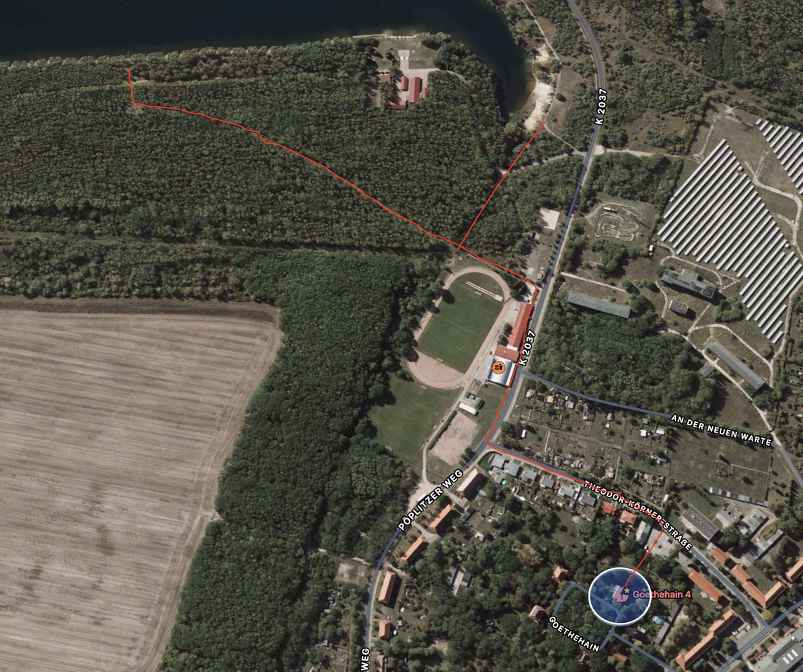
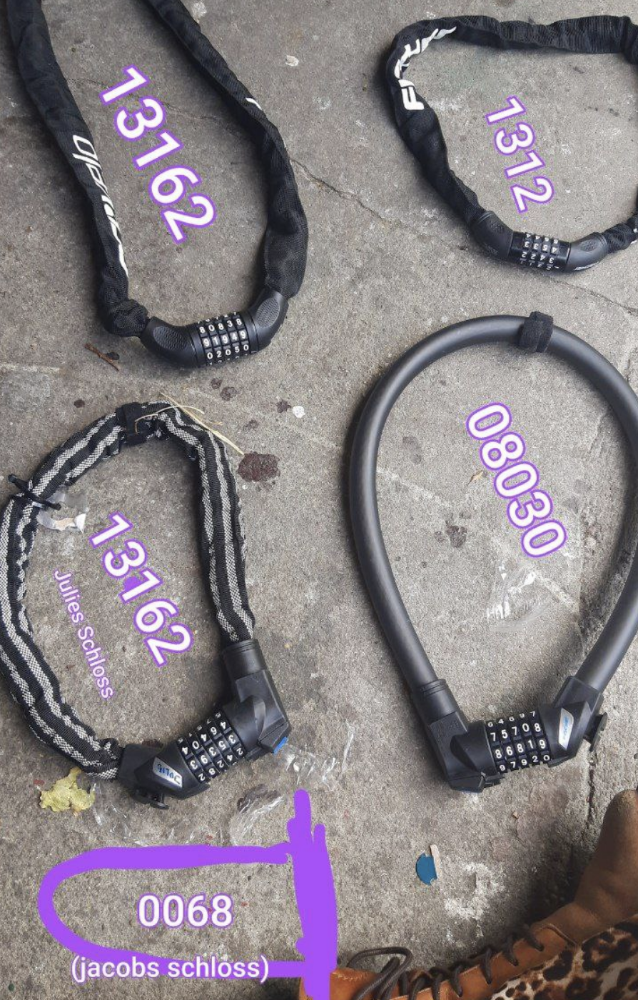

[*Im Browser öffnen*](https://zezhaus.github.io/how-to/)

*Last Updated 24. November 2024*

# 🌷
# How To ZEZ

Welcome to Zweckverband Erholungswesen Zschornewitz (ZEZ) ! 

Here you will find all the basic info for the house. Please be sure to complete the [Exit Checklist](#exit-checklist) before you leave 🍄

For current heating info see [🥵 Heating](#heating).

#### [Deutsche Version](#index-de)

## Index {#index}

- [📍 Getting Here](#getting-here)
- [💶 Costs](#costs)
- [🏡 At the Haus](#at-the-haus)
	- [🪴 Rooms](#rooms)
	- [🥕 Kitchen & Food](#kitchen)
	- [🛏 Sheets & Towels](#sheets)
	- [🪵 Fireplace & Wood](#fireplace)
	- [🥵 Heating](#heating)
	- [🧺 Laundry](#laundry)
	- [🧹 Chores](#chores)
	- [🔧 Workshop & Tools](#workshop)
- [🏝 Around the Haus](#around-the-haus)
	- [🦆 How to get to the lake](#lake)
	- [🚲 Bikes](#bikes)
	- [🛒 Supermarket/Shops/Letterbox](#shops)
- [✔️ Exit Checklist](#exit-checklist)  

## 📍 Getting Here {#getting-here}

### Planning your trip
- Download the app “DB navigator”. This gives you the most accurate train schedules, and you can purchase your train tickets directly on the app. *Google Maps can be unreliable*
- You can use the website bahn.de as well if you have trouble installing the app and get a your ticket at a machine at the station
- The train station closest to the house is called “Gräfenhainichen”
- The bus station closest to the house is called “Zschornewitz Lehrwerkstatt”
- You’re more likely to see ICE/IC (InterCity /Express, fast trains) connections, they are more expensive
- To see cheaper regional trains, under the search options uncheck “show fastest connection”
- A Deutschland Ticket, available for €49 via [bahn.de](https://bahn.de), will cover the costs of regional trains plus any local transport (including Rufbus).
- If you see a “Rufbus” on your connection (calling bus), the bus only goes if it has been called for (after 17h and on the weekends). Make plans with the roommates to pick you up from the train station or make a reservation with the Rufbus using the [mopla app](https://app.mopla.solutions/).

### On your trip
- When you arrive at Gräfenhainichen station, there is the Bus 330 (towards Möhlau) that drops you directly at our street.
- Our stop is called “Zschornewitz Lehrwerkstatt” (you can show the bus driver this name when you get on the bus haha)
For the bus you’ll need some coins for the ticket. Bus not included in the train ticket (unless you have a Deutschland Ticket).
- The timing of when the bus leaves is usually aligned very well with when the S-Bahn train arrives at the train station. It’s always hourly at xx:39 (So if you arrive 14:31 you’ll be able to catch the bus at 14:39 for example).
- If all fails and you can’t reach any of the housemates for a pickup, call the taxi: +49 152 29549135

<a class="toplink" href="#index">&uarr; back to index</a>

## 💶 Costs {#costs}

### Short Stays
- Food is €7/day, which includes all meals, snacks, and drinks. We prefer cash (deposited in the Pink Wallet by the kitchen), but can also accept Paypal, address [@zschoenesleben](https://paypal.me/zschoenesleben).
- Accommodation in the house is €15/night. We can take cash or EU bank transfer. Ask Patty for our house IBAN.
- please ask us about solidarity rates.

### Longer Stays
- our rent is €450 per month, which includes all bills. Please ask Patty for the house IBAN.
- Food is still €7/day or €210/month, via cash or paypal.
- we also offer solidarity rates.

### Food calender
- In the calendar we keep track of the days we're at ZEZ and mark the days we have paid food money for.
- Please refer to the poster next to the calendar for information on how to updated the calendar. 

<a class="toplink" href="#index">&uarr; back to index</a>

---

## 🏡 At the Haus {#at-the-haus}

Feel free to use our [Telegram Group](https://t.me/+diD1q9Kbf8k1ZjFi).

### 🪴 Rooms {#rooms}

#### Ground Floor
- Briefkaste (Julie, Tiffy)
- Tropical Island (Murmi)
- The West Wing (Jacob)

#### First Floor
- Sun Room (3-6 sleeping places, Leo)
- Kimchi Salon (Eve)
- Butterfly Hotel (Kay)
- Twerkstatt (occupied, Johanna)
- Milchstraße (occupied, Patty)

#### Second Floor
- Guest Room/Aquarium (2 sleeping places)
- Treehouse (Cécil)

<a class="toplink" href="#index">&uarr; back to index</a>

### 🥕 Kitchen & Food {#kitchen}

Please help yourself to anything in the fridge or the cupboards. If there's anything you would like from the shop, add it to the grocery list (check the fridge). We usually cook one group meal per day in the evenings.

#### Trash
Please sort your trash :) There’s an overview on the kitchen wall.

- Trash ("Restmüll") &rarr; **Kitchen**
- Recyling (packaging, no leftovers) &rarr; **Kitchen**
- Paper (no handkerchiefs) &rarr; **Kitchen**
- Glass (food containers, wine and sparkling wine bottles) &rarr; **Outside** in front of the front stairs
- Pfand (all cans that had drinks in them, plastic bottles and beer/soda bottles) &rarr; **Outside** in front of the front stairs
- Food scraps/Biomüll (no meat) &rarr; **Kitchen** green compost box

#### Compost / Biomüll
- empty kitchen bin into the compost pile in the garden. See map by the kitchen door or ask a housemate. 

#### Dishwasher
- Tabs are under the sink
- Please keep knives with wooden handles, wooden utensils, and chop sticks out of the dishwasher

#### Basement storage
- You will find extra dry/canned goods (ie pasta, beans, cartoned milk, juices), toilet paper, paper towels and other bits in the basement.
- There’s a big freezer box, usually there’s bread in there.

<a class="toplink" href="#index">&uarr; back to index</a>

### 🛏 Sheets & Towels {#sheets}

#### Bedding (Bettwäsche)
- Bedding is in the closet by the downstairs bathroom
- If you notice any used bedding, please throw it in one of the laundry baskets either the upper or lower hallways. Better yet — run a wash !

#### Towels (Handtücher)
- Towels are in between the bottom and first floor in the drawer/closet. 

<a class="toplink" href="#index">&uarr; back to index</a>

### 🪵 Wood stove {#fireplace}

While it’s cold we try to keep the fire going 24/7 and ventilate the air to the other rooms. Please keep the doors to the stairways closed. If you are the first person to wake up, please make a fire. Those who live on each floor are responsible for the fireplace on their floor. **One of the things we do is that everyone after waking up gets one box of firewood outside.** Please ask whoever is around at the time what firewood is dry and can be used.

#### How to make a fire
1. Open all air controls for max airflow to get the oven as hot as possible with the first round of wood
	- **Open the control on the stovepipe.** Open = parallel to the direction of the pipe
	- Downstairs: push the 2 air controls above and below the glass to the right (open)
	- Upstairs: Open the lower door and turn the air control clockwise to 5-6
1. Take 2 logs of "fast wood" and put them flush to the floor, leave a little room so air can get in
1. Put a good amount of little sticks or bark on top, stack them 2-3 layers and leave room for air flow
1. Set fire to fire starter and put it between or on top of the twigs, close the door quickly

#### Keeping the fire alive
1. At this point: Caution, all the handles are too hot to be touched, use the red oven mitts!
1. Open the door only when there are no more flames, take a metal tool and move the embers around (ash falls down and airflow is better)
	- Don’t worry if there is only little embers left, it’ll catch fire so long the stove is hot still
1. When putting more wood on the fire, use "slow wood", it will burn for longer
	- Upstairs: use 2 logs
	- Downstairs: use 1 log
1. For a minute or 2, keep the air controls open or open them
1. When the logs burn well and are black all over, reduce airflow
	- Downstairs: Push the air vent *above* the glass all the way to the left, push the vent *below* the glass almost completely to the left
	- Upstairs: Turn the air control next to the ash drawer (behind lower door) to almost 0 (counter-clockwise)
	- Both: Turn the air control on the pipe to an angle of about 45° to the pipe direction or a bit further
	- The flames should be slower but still bright and friendly. If they start to get darker and are far away from the wood, open the pipe valve back up a little bit. It may take a minute to find the sweet spot of calm bright flames

#### Learnings
- The wood should burn cleanly, without smoke
- If you see black soot building up on the glass and walls, try to raise the temperature by increasing the air flow
- Don’t close the air controls too much. Starving the fire of air can produce toxic gases, can lead to flash fires (gas detonations) and excessive amounts of soot can lead to chimney fires. The flames should always be bright and friendly

<a class="toplink" href="#index">&uarr; back to index</a>

### 🥵 Heating {#heating}
- Hot water should always be available throughout the day. It is being produced during these times: 6:30–9:30, 14:00–14:20, and 19:00–22:00
- To heat a room on a floor with a woodburing stove, leave the door open during the day to let the heat in
- When a room is not in use, turn down the thermostat and close the door
- Currently the oil heating is **on** in the morning and in the evening. Please leave the thermostat on 19°C which is the standard room temperature we agreed on. You can turn it above that but please remember to turn it back
- Thermostat numbers determine at what temperature the valve is being closed, so turning it to a higher number does not heat your room more quickly
- Home assistant, our smart home system is accessible on our home wifi [http://homeassistant.local:8123](http://homeassistant.local:8123). You can use the username `guest` and password `guest`

<a class="toplink" href="#index">&uarr; back to index</a>

### 🧺 Laundry {#laundry}

- There is a laundry machine in the basement in the boiler room. Go to the basement and take two doors on your right hand side
- It's better to use too little than too much detergent (bad for machine and your laundry). Aim for 1-2 shots.
- Leave the tray and door open after use for ventilation in the machines
- Please dry laundry on a drying rack in a heated room or outside
- We do have a dryer, but please use it only as needed to conserve electricity
- Before using the dryer, remove filter from the bottom corner of the opening and take out fluff (you’ll love it)

<a class="toplink" href="#index">&uarr; back to index</a>

### 🧹 Chores {#chores}

Please do one big chore once a week (usually there is a list on the kitchen door and it is also posted in the At The Haus group every week). You can claim a chore if there’s one you prefer to do, please put your name on the chart!

<a class="toplink" href="#index">&uarr; back to index</a>

### 🔧 Workshop & Tools {#workshop}

Talk to Jacob before taking tools from the workshop.

<a class="toplink" href="#index">&uarr; back to index</a>

## 🏝 Around the Haus {#around-the-haus}

### 🦆 How to get to the lake {#lake}

Go around the house through the back entrance of the garden to the parking lot. Turn left and follow the street to the T-intersection. Turn right, along the sports field. Turn left at Sunny’s Restaurant, along the sports field and follow the road straight ahead through the forest to the forest spot, turn right behind the fence/before entering the forest for the sand beach.

### 🚲 Bikes {#bikes}

We have bikes to borrow. Just ask.

### 🛒 Supermarket/Shops/Letterbox {#shops}

- Netto is 30 minutes away walking
- Be sure to check out the Wurstautomat :)
- There is a cigarette vending machine on the main road next to the bus station
- In the village there is a kiosk/post office to mail packages

<a class="toplink" href="#index">&uarr; back to index</a>

## Exit Checklist {#exit-checklist}

Coming soon !

<a class="toplink" href="#index">&uarr; back to index</a>

---

## Inhaltsverzeichnis {#index-de}

- [📍 Anreise](#getting-here-de)
- [💶 Kosten](#costs-de)
- [🏡 Im Haus](#at-the-haus-de)
  - [🪴 Zimmer](#rooms-de)
  - [🥕 Küche & Essen](#kitchen-de)
  - [🛏 Bettwäsche & Handtücher](#sheets-de)
  - [🪵 Kamin & Holz](#fireplace-de)
  - [🥵 Heizung](#heating-de)
  - [🧺 Wäsche](#laundry-de)
  - [🧹 Hausarbeit](#chores-de)
  - [🔧 Werkstatt & Werkzeuge](#workshop-de)
- [🏝 Um das Haus herum](#around-the-haus-de)
  - [🦆 Wie man zum See kommt](#lake-de)
  - [🚲 Fahrräder](#bikes-de)
  - [🛒 Supermarkt/Läden/Briefkasten](#shops-de)
- [✔️ Auscheckliste](#exit-checklist-de)

## 📍 Anreise {#getting-here-de}

### Reiseplanung
- Laden Sie die App "DB Navigator" herunter. Diese bietet Informationen zu Fahrplänen, Strecken und Tarifen der Deutschen Bahn, gibt Ihnen die genauesten Fahrpläne und Sie können Ihr Ticket direkt in der App kaufen. *Google Maps kann unzuverlässig sein*
- Sie können auch die Website bahn.de nutzen, wenn Sie Probleme beim Installieren der App haben, und Ihr Ticket an einem Automaten am Bahnhof kaufen.
- Der nächstgelegene Bahnhof zum Haus heißt „Gräfenhainichen“.
- Die nächste Bushaltestelle zum Haus heißt „Zschornewitz Lehrwerkstatt“.
- Sie werden wahrscheinlich ICE/IC (InterCity/Express, Schnellzüge) Verbindungen sehen, die teurer sind.
- Um günstigere Regionalzüge zu sehen, deaktivieren Sie unter den Suchoptionen „schnellste Verbindung anzeigen“.
- Ein Deutschland-Ticket, erhältlich für 49 € über [bahn.de](https://bahn.de), deckt die Kosten für Regionalzüge sowie den lokalen Transport (einschließlich Rufbus).
- Wenn Sie einen „Rufbus“ auf Ihrer Verbindung sehen (Anrufbus), fährt der Bus nur, wenn er für Sie bestellt wurde (nach 17 Uhr und an Wochenenden). Machen Sie mit den Mitbewohnern einen Plan, dass sie Sie am Bahnhof abholen, oder reservieren Sie den Rufbus über die [mopla App](https://app.mopla.solutions/).

### Auf Ihrer Reise
- Wenn Sie am Bahnhof Gräfenhainichen ankommen, gibt es den Bus 330 (Richtung Möhlau), der Sie direkt zu unserer Straße bringt.
- Unsere Haltestelle heißt „Zschornewitz Lehrwerkstatt“ (Sie können dem Busfahrer diesen Namen zeigen, wenn Sie in den Bus einsteigen, haha).
Für den Bus benötigen Sie etwas Kleingeld für das Ticket. Der Bus ist nicht im Zugticket enthalten (es sei denn, Sie haben ein Deutschland-Ticket).
- Die Abfahrtszeiten des Busses sind normalerweise sehr gut auf den Zeitpunkt abgestimmt, zu dem die S-Bahn am Bahnhof ankommt. Der Bus fährt immer zur vollen Stunde um xx:39 (Wenn Sie also um 14:31 ankommen, können Sie den Bus um 14:39 nehmen).
- Falls alles fehlschlägt und Sie niemanden aus dem Haus erreichen können, um abgeholt zu werden, rufen Sie ein Taxi: +49 152 29549135

<a class="toplink" href="#index-de">&uarr; zurück zum Index</a>

## 💶 Kosten {#costs-de}

### Kurzaufenthalte
- Die Kosten für Essen betragen 7 € pro Tag und beinhalten alle Mahlzeiten, Snacks und Getränke. Wir bevorzugen Bargeld (eingezahlt in das rosa Portemonnaie) beim Kalender bei der Küche, aber wir akzeptieren auch Paypal, Adresse [@zschoenesleben](https://paypal.me/zschoenesleben).
- Unterkunft im Haus kostet 15 €/Nacht. Wir nehmen Bargeld oder eine EU-Überweisung an. Fragen Sie Patty nach unserer Haus-IBAN.
- Bitte fragen Sie uns nach Solidaritätsraten.

### Längere Aufenthalte
- Unsere Miete beträgt 450 € pro Monat, was alle Nebenkosten beinhaltet. Bitte fragen Sie Patty nach der Haus-IBAN.
- Essen kostet weiterhin 7 € pro Tag oder 210 € pro Monat, per Bargeld oder Paypal.
- Wir bieten auch Solidaritätsraten an.

### Essenskalender
- Im Kalender halten wir die Tage fest, an denen wir im ZEZ sind, und markieren die Tage, an denen wir für das Essen bezahlt haben.
- Bitte beachten Sie das Poster neben dem Kalender für Informationen, wie der Kalender aktualisiert wird.

<a class="toplink" href="#index-de">&uarr; zurück zum Index</a>

---

## 🏡 Im Haus {#at-the-haus-de}

Fühlen Sie sich frei, unsere [Telegram-Gruppe](https://t.me/+diD1q9Kbf8k1ZjFi) zu nutzen.

### 🪴 Zimmer {#rooms-de}

#### Erdgeschoss
- Briefkaste (Julie, Tiffy)
- Tropical Island (Murmi)
- West Wing (Jacob)

#### Erster Stock
- Sun Room (3-6 Schlafplätze, Leo)
- Kimchi Salon (Eve)
- Butterfly Hotel (Kay)
- Twerkstatt (Johanna)
- Milchstraße (Patty)

#### Zweiter Stock
- Gästezimmer/Aquarium (2 Schlafplätze)
- Baumhaus (Cécil)

<a class="toplink" href="#index-de">&uarr; zurück zum Index</a>

### 🥕 Küche & Essen {#kitchen-de}

Bitte bedienen Sie sich an allem im Kühlschrank oder in den Schränken. Wenn Sie etwas aus dem Geschäft möchten, fügen Sie es der Einkaufsliste hinzu (prüfen Sie den Kühlschrank). Wir kochen normalerweise einmal am Tag ein gemeinsames Abendessen.

#### Müll
Bitte sortieren Sie Ihren Müll :) Es gibt eine Übersicht an der Wand in der Küche.

- Müll ("Restmüll") → **Küche**
- Recycling (Verpackungen, keine Essensreste) → **Küche**
- Papier (keine Taschentücher) → **Küche**
- Glas (Lebensmittelbehälter, Wein- und Sektflaschen) → **Draußen** vor den Vordertreppen
- Pfand (alle Dosen, die Getränke enthalten haben, Plastikflaschen und Bier/Soda-Flaschen) → **Draußen** vor den Vordertreppen
- Essensreste/Bioabfall (kein Fleisch) → **Küche** grüne Kompostbox

#### Kompost / Biomüll
- Leeren Sie den Kücheneimer in den Komposthaufen im Garten. Siehe Karte an der Küchentür oder fragen Sie eine:n Mitbewohni.

#### Geschirrspüler
- Tabs befinden sich unter dem Spülbecken
- Bitte halten Sie Messer mit Holzgriffen, Holzutensilien und Essstäbchen aus dem Geschirrspüler fern.

#### Kellerlagerung
- Im Keller finden Sie zusätzliche Trockenwaren/Dosen (z. B. Pasta, Bohnen, Kartonmilch, Säfte), Toilettenpapier, Papierhandtücher und andere Dinge.
- Es gibt eine große Gefriertruhe, in der normalerweise Brot zu finden ist.

<a class="toplink" href="#index-de">&uarr; zurück zum Index</a>

### 🛏 Bettwäsche & Handtücher {#sheets-de}

#### Bettwäsche
- Bettwäsche befindet sich im Schrank neben dem Badezimmer im Erdgeschoss.
- Wenn Ihnen gebrauchte Bettwäsche auffällt, werfen Sie diese bitte in einen der Wäschekörbe in den oberen oder unteren Fluren. Noch besser — waschen Sie sie!

#### Handtücher
- Handtücher befinden sich zwischen dem Erdgeschoss und dem ersten Stock im Schrank/Schublade.

<a class="toplink" href="#index-de">&uarr; zurück zum Index</a>

### 🪵 Holzofen {#fireplace-de}

Wenn es kalt ist, versuchen wir, das Feuer 24/7 am Brennen zu halten und die Luft in die anderen Zimmer zu leiten. Bitte halten Sie die Türen zu den Treppenhäusern geschlossen. Wenn Sie die erste Person sind, die aufwacht, machen Sie bitte ein Feuer. Diejenigen, die auf jedem Stockwerk wohnen, sind für den Kamin auf ihrem Stockwerk verantwortlich. **Eine der Aufgaben, die wir haben, ist, dass jeder nach dem Aufwachen eine Kiste/Tüte Holzscheite von nach draußen holt.** Fragen Sie bitte, was für Holz trocken ist und verwendet werden kann.

#### Wie man ein Feuer macht
1. Öffnen Sie alle Luftsteuerungen für maximalen Luftstrom, um den Ofen mit der ersten Holzrunde so heiß wie möglich zu machen.
   - **Öffnen Sie die Steuerung am Ofenrohr.** Offen = parallel zur Richtung des Rohres
   - Unten: Schieben Sie die 2 Luftsteuerungen über und unter dem Glas nach rechts (offen)
   - Oben: Öffnen Sie die untere Tür und drehen Sie die Luftsteuerung im Uhrzeigersinn auf 5-6
1. Nehmen Sie 2 Scheite "Fast Wood" und legen Sie sie bündig zum Boden, lassen Sie etwas Platz, damit Luft hineinkommen kann.
1. Legen Sie eine gute Menge kleiner Äste oder Rinde obenauf, stapeln Sie sie in 2-3 Schichten und lassen Sie Platz für den Luftstrom.
2. Zünden Sie den Feuerstarter an und legen Sie ihn zwischen oder auf die Ästchen, schließen Sie die Tür schnell.

<a class="toplink" href="#index-de">&uarr; zurück zum Index</a>

### 🧺 Wäsche {#laundry}

- Wir haben eine Waschmaschine. Verwenden Sie bitte nur die notwendige Menge Waschmittel (weniger ist besser, zu viel Waschmittel ist schlecht für die Maschine und Ihre Wäsche). Ziel: 1-2 Shotgläser.
- Lassen Sie das Fach und die Tür nach der Nutzung geöffnet, damit die Maschinen gut belüftet werden können.
- Trocknen Sie die Wäsche auf einem Wäscheständer in einem beheizten Raum oder draußen.
- Wir haben einen Trockner, aber bitte nutzen Sie ihn nur nach Bedarf, um Strom zu sparen.
- Vor der Nutzung des Trockners entfernen Sie bitte den Filter aus der unteren Ecke der Öffnung und nehmen Sie den Flusen heraus (das wird Ihnen gefallen).

<a class="toplink" href="#index-de">&uarr; zurück zum Index</a>

### 🧹 Hausarbeit {#chores-de}

Bitte übernehmen Sie einmal pro Woche eine große Hausarbeit (normalerweise gibt es eine Liste an der Küchentür, und es wird auch jede Woche in der "At The Haus"-Gruppe gepostet). Sie können eine Aufgabe übernehmen, wenn es eine gibt, die Sie bevorzugen. Bitte tragen Sie Ihren Namen in die Liste ein!

<a class="toplink" href="#index-de">&uarr; zurück zum Index</a>

### 🔧 Werkstatt & Werkzeuge {#workshop-de}

Sprechen Sie mit Jacob, bevor Sie Werkzeuge aus der Werkstatt nehmen.

<a class="toplink" href="#index-de">&uarr; zurück zum Index</a>

---

## 🏝 Um das Haus herum {#around-the-haus-de}

### 🦆 Wie man zum See kommt {#lake-de}

Gehen Sie um das Haus durch den hinteren Eingang des Gartens zum Parkplatz. Biegen Sie links ab und folgen Sie der Straße bis zur T-Kreuzung. Biegen Sie rechts ab, entlang des Sportplatzes. Biegen Sie bei Sunny’s Restaurant links ab, entlang des Sportplatzes, und folgen Sie der Straße geradeaus durch den Wald bis zum Waldrand. Biegen Sie rechts ab hinter dem Zaun, bevor Sie den Wald betreten, um den Sandstrand zu erreichen.

### 🚲 Fahrräder {#bikes-de}

Wir haben Fahrräder zum Ausleihen. Einfach fragen.

### 🛒 Supermarkt/Läden/Briefkasten {#shops-de}

- Netto ist 30 Minuten zu Fuß entfernt.
- Vergessen Sie nicht, den Wurstautomat zu besuchen :)
- Es gibt einen Zigarettenautomaten an der Hauptstraße neben der Bushaltestelle.
- Im Dorf gibt es einen Kiosk/Postamt, um Pakete zu versenden.

<a class="toplink" href="#index-de">&uarr; zurück zum Index</a>

---

## Auscheckliste {#exit-checklist-de}

Kommt bald!

<a class="toplink" href="#index-de">&uarr; zurück zum Index</a>
